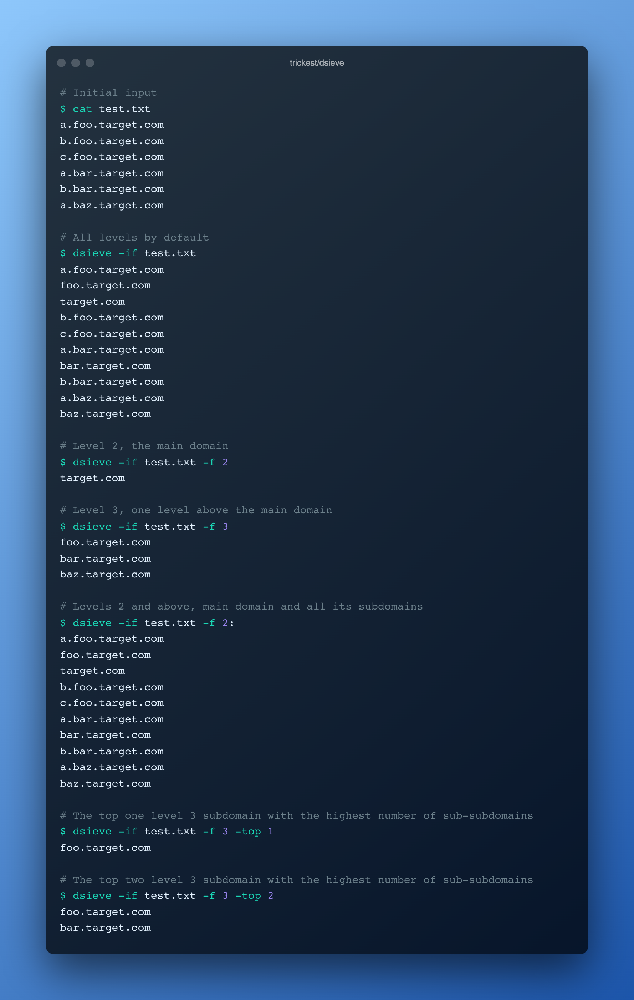

<h1 align="center">dsieve <a href="https://twitter.com/intent/tweet?text=dsieve%20-%20Make%20URL%20path%20combinations%20using%20a%20wordlist%20https%3A%2F%2Fgithub.com%2Ftrickest%2Fdsieve&hashtags=bugbounty,bugbountytips,infosec"></a></h1>
<h3 align="center">Filter and enrich a list of subdomains by level</h3>



Take a single domain or read an input file and extract unique parent domains, enrich subdomains, filter subdomains by level, or find out which subdomains have the most number of sub-subdomains (or sub-sub-subdomains or sub-sub-sub...). Dsieve supports any format of URL, with or without protocol, port, path, parameters.

# Installation
## Binary
Binaries are available in the [latest release](https://github.com/trickest/dsieve/releases/latest).

## Docker
```
docker run quay.io/trickest/dsieve
```

## From source
```
go install github.com/trickest/dsieve@latest
```

# Usage
```
  -f string
    	Filter domain level. Use python slice notation to select range.
    	Example input: foo.bar.baz.tld
    	  -f 3      bar.baz.tld
    	  -f 3:     bar.baz.tld, foo.bar.baz.tld
    	  -f 2:4    baz.tld, bar.baz.tld
    	  -f :3     tld, baz.tld
  -i string
    	Input url or domain
  -if string
    	Input file path, one url/domain per line.
  -o string
    	Output file path, optional
  -top int
    	Only consider top X subdomains of a certain level and return all their subdomains
```

### Example
##### wordlist.txt
```
dev
prod/
admin.py
app/login.html
```

```shell script
$ dsieve -d example.com -l 2 -w wordlist.txt
example.com/dev
example.com/prod
example.com/dev/dev
example.com/prod/dev
example.com/dev/prod
example.com/prod/prod
example.com/dev/admin.py
example.com/dev/app/login.html
example.com/prod/admin.py
example.com/prod/app/login.html
example.com/dev/dev/admin.py
example.com/dev/dev/app/login.html
example.com/prod/dev/admin.py
example.com/prod/dev/app/login.html
example.com/dev/prod/admin.py
example.com/dev/prod/app/login.html
example.com/prod/prod/admin.py
example.com/prod/prod/app/login.html

```

# Report Bugs / Feedback
We look forward to any feedback you want to share with us or if you're stuck with a problem you can contact us at [support@trickest.com](mailto:support@trickest.com). You can also create an [Issue](https://github.com/trickest/dsieve/issues/new) or pull request on the Github repository.

# Where does this fit in your methodology?
Dsieve is an integral part of many workflows in the Trickest store. Sign up on [trickest.com](https://trickest.com) to get access to these workflows or build your own from scratch!

[](https://trickest-access.paperform.co/)
